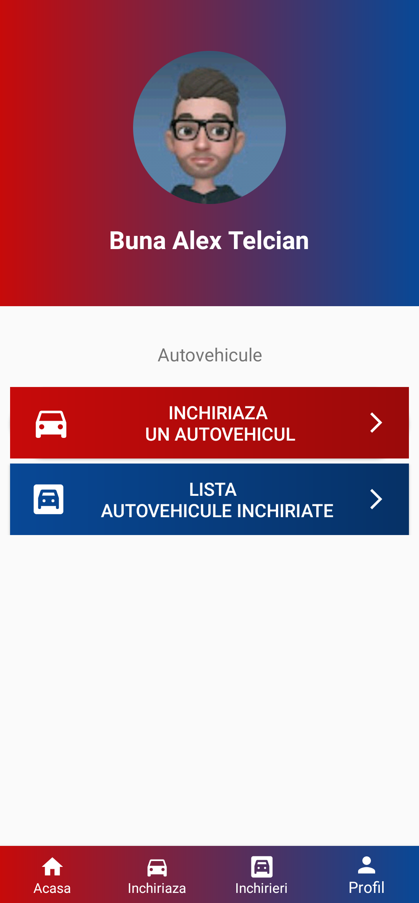
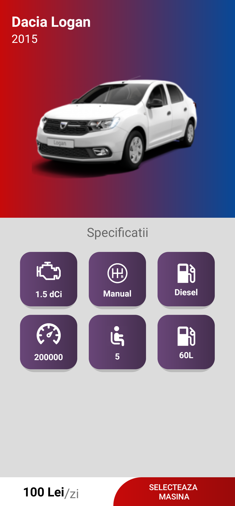
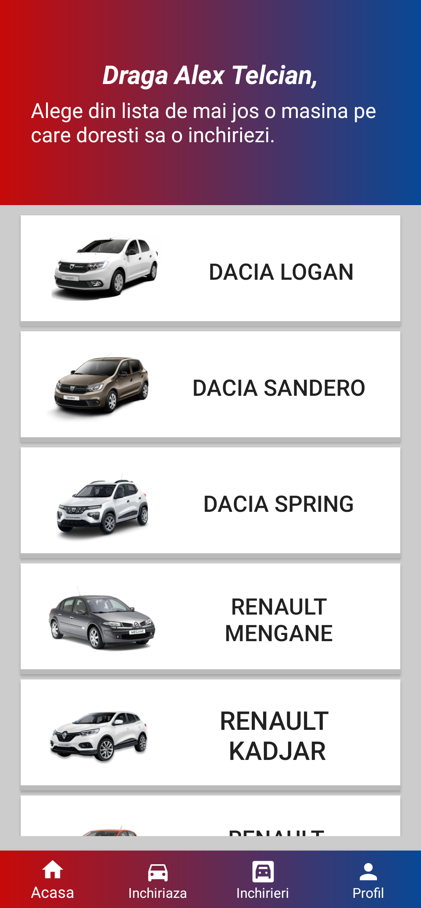

# RentSystem
<h2 align = center> Description</h2>

Rent System is a mobile application for the Android platform. The role of the application is to rent a vehicle, but in the future the application will be modified in such a way that certain properties or homes can be rented.

<h3> Implementation details </h3>

<ul>
  <li>Java</li>
  <li> Android app</li>
  <li> Android Studio IDE</li>
  <li> XML</li>
  <li> Registration</li>
</ul> 

<h3>Screenshots</h3>

           

<h3> Languages and Tools </h3>

      
